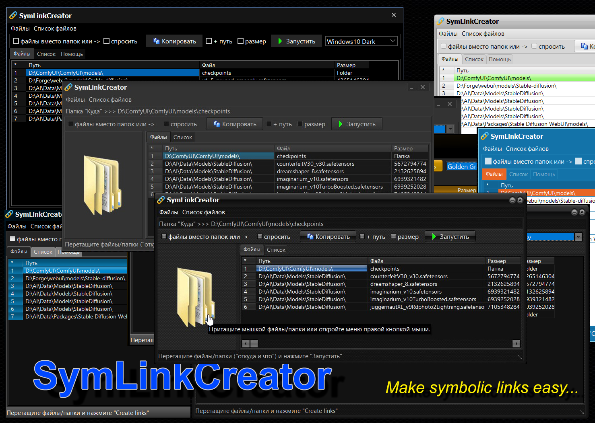

# SymLinkCreator (Windows x32) Release v1.2.1

**Создатель символических ссылок на файлы и папки - Windows x32 приложение**

> Creator of symbolic links on files and folders - Windows x32 application

> 新增中文介面語言和中文說明。 尚不支援中文路徑和檔案名稱（將來會新增）。
---

---
## 
---

К примеру: слева путь к папке моделей _**"ComfyUI"**_, справа папка моделей _**"automatic1111"**_, внизу наша программа.
Для удобства работы лучше сразу приготовьте открытые в нужном месте окна с папками _**"Куда"**_ и _**"Откуда"**_.

> For example: on the left is the path to the folder of models "**_ComfyUI_**", on the right is the folder of models "**_automatic1111_**", at the bottom is our program.
> For the convenience of work, it is better to immediately prepare windows open in the right place with the "**_Where_**" and "**_From_**" folders.

## 

Запускаем "**SymLinkCreato**

> Start "**SymLinkCreator**"

## 

Первой строкой списка всегда должны быть папка «**Куда**» _(Назначение)_!!! Стаскиваем ее мышкой в окно программы.

> The first line of the list should always be the "**Where To**" _(Destination)_ folder!!! Drag it with the mouse into the program window.

## 

---

Путь к папке вставился в первую строку списка. Если программу что-то не устроит, или она не найдет реальный путь к папке в системе, строка будет удалена.

> The path to the folder was inserted into the first line of the list. If the program is not satisfied with something, or it does not find the real path to the folder in the system, the line will be deleted.

## 

---

После того, как первой строкой вставлен путь к папке, в которой будут создаваться ссылки, тащим в окно произвольное количество папок и файлов, количество которых ограничено настройками в **INI**-файле, который появится рядом с программой после первого выхода из нее. (По умолчанию количество файлов в списке ограничено **25**, чтобы вы случайно не стащили в окно каталог Windows (к примеру). Вы можете изменить это значение в INI-файле, и перезапустить программу, но это на вашу ответственность, я думаю, вы понимаете, что делаете).

> After the path to the folder in which links will be created is inserted in the first line, we drag an arbitrary number of folders and files into the window, the number of which is limited by the settings in the ini-file that appears next to the program after the first exit from it. (By default, the number of files in the list is limited to 25, so that you don't accidentally swipe the Windows directory into the window (for example). You can change this value in the INI file and restart the program, but it's your responsibility, I think you understand what you're doing).

## 

---

Ссылки на "притащенные" файлы вставляются в список

> Links to the "dragged" files are inserted into the list

## 

---

Для создания ссылок нажмите кнопку «Create links»

> To create links, click the "Create links" button

## 

---

Программа прочитает список и создаст в папке из первой строки символические ссылки на все, что что перечислено в строках ниже первой.

> The program will read the list and create symbolic links in the folder from the first line to everything listed in the lines below the first one.

## 

---

Если там, в списке, попадется папка, то ссылка на нее будет создана как «ссылка на папку». После того, как ссылки будут созданы, их можно будет переименовать как обычный файл, если имя ссылки по новому месту должно отличаться от имени по старому месту, это относится как к файлам, так и к папкам. По умолчанию на папки, «стащенные» в список, ссылки создаются именно «как на папки». Если в список надо вставить ссылку не на саму папку, а на все сложенные в нее файлы, то перед «стаскиванием» этих объектов надо включить чек-бокс «files instead of folders» или «ask all time». Если включен «files instead of folders», то вместо ссылок на сами папки в список будут включаться ссылки на все вложенные в нее файлы, программа сама зайдет в папку, перечитает ее содержимое, и вставит адреса всех вложенных в папку файлов. Если включен «ask all time», то программа при каждом «стаскивании» будет выводить окно с вопросом, что включать, файлы или папки, и поступать в зависимости от ответа пользователя.

> If there is a folder in the list, then a link to it will be created as a "folder link". After the links are created, they can be renamed as a regular file, if the name of the link in the new location should differ from the name in the old location, this applies to both files and folders. By default, links to folders "dragged" into the list are created exactly "as folders". If you need to insert a link not to the folder itself, but to all the files stacked in it, then before "pulling off" these objects, you need to include the "files instead of folders" or "ask all time" checkbox. If "files instead of folders" is enabled, then instead of links to the folders themselves, links to all files attached to it will be included in the list, the program itself will go into the folder, re-read its contents, and paste the addresses of all files attached to the folder. If "ask all time" is enabled, then the program will display a window with the question what to include, files or folders, and arrive depending on the user's response.

## 

---

Список файлов в окне может быть отредактирован – могут быть удалены какие-то строки, а на их место «притащены» новые файлы, в пределах лимита количества файлов в списке, установленного в ini-файле. Удаление строк в списке производится нажатием «DEL» (Delete), или выбором пункта в главном или pip-up меню. Операция применяется к текущей выделенной строке.
Текущий список файлов можно сохранить. Списки в окне можно как сохранять, так и загружать ранее сохраненные списки.

> The list of files in the window can be edited – some lines can be deleted, and new files are "dragged" in their place, within the limit of the number of files in the list set in the ini file. Deleting lines in the list is performed by pressing "DEL" (Delete), or by selecting an item in the main or pip-up menu. The operation is applied to the currently selected row.
> The current list of files can be saved. The lists in the window can be saved or downloaded from previously saved lists.

## 

---

Списки можно составлять самому, единственное условие, что первая строка списка должна быть адресом папки, а не файла, т.к. она автоматически становится папку «Куда». Длина списка может быть любой, но при загрузке списка в программу, список обрежется на количество строк, установленном в ini-файле. Если программу что-то не устроит в списке файлов, она его не примет.

> You can make lists yourself, the only condition is that the first line of the list should be the address of the folder, not the file, because it automatically becomes the "Where" folder. The length of the list can be any, but when loading the list into the program, the list will be cut off by the number of lines set in the ini-file. If the program is not satisfied with something in the file list, it will not accept it.

---

Кроме сохранения списка файлов, текущие открытые списки можно копировать в буфер, как список только имен файлов, так и как список с полными путями файлов и размером файлов, что устанавливается чек-боксами
«+ size» и «+ path».

> In addition to saving the list of files, the current open lists can be copied to the clipboard as a list of only file names, or as a list with full file paths and file size, which is set by the "+size" and "+ path" checkboxes.

---

После закрытия программы (если она запускалась первый раз), она создаст служебные папки «Bat» и «Logs», в которые, после выполнения составленного скрипта, поместит в первую папку выполненный bat-файл с именем «штамп времени + имя программы.bat», а во вторую папку будет кидать логи «когда, во сколько и какой файл запускался». На выполнение программа запускает копию BAT-файла из папки «Bat», с именем «temp.bat», который после выполнения удаляется через 0.5 секунды. Для повторения выполненного скрипта используйте bat-файл из папки «Bat», переименовав его так, как вам хочется. Его можно безопасно вставлять в bat-файл запуска программы для восстановления ссылок перед стартом, т.к. в случае наличия ссылки на месте ее создания, она не перезаписывается.

> After closing the program (if it was launched for the first time), it will create the service folders "Bat" and "Logs", in which, after executing the compiled script, it will place the executed bat file named "time stamp + program name" in the first folder.bat", and logs "when, at what time and which file was launched" will be thrown into the second folder. For execution, the program runs a copy of the BAT file from the "Bat" folder, named "temp.bat", which is deleted after 0.5 seconds after execution. To repeat the executed script, use the bat file from the "Bat" folder, renaming it the way you want. It can be safely inserted into the bat file of the program startup to restore links before starting, because if there is a link at the place of its creation, it is not overwritten.

---

BAT-файл записывается для совместимости в 866 кодировке, наследие DOS (!), для того, чтобы не иметь проблем с кириллицей. Адреса заключены в парные скобки, чтобы не иметь проблем с пробелами в именах путей и файлов. Для выполнения скрипта используется команда mklink, которую вы в системе не найдете. («Видишь суслика? Нет! Вот и я не вижу. А он есть!»)

> The BAT file is written for compatibility in 866 encoding, a legacy of DOS (!), in order not to have problems with Cyrillic. The addresses are enclosed in paired brackets so as not to have problems with spaces in the names of paths and files. To execute the script, the mklink command is used, which you will not find in the system. ("Do you see a gopher? No! So I don't see it either. And he is!")

## 

---

Логика «не навреди»:
Если в папке «Куда» происходит ЛЮБОЙ КОНФЛИКТ ИМЕН, то эта строка не выполняется!
Ни один существующий объект не будет удален или перезаписан!

> The "do no harm" logic:
> If ANY NAME CONFLICT occurs in the "Where" folder, then this line is not executed!
> No existing object will be deleted or overwritten!

---

Кроме того, программа создает у себя свои:
• ini-файл, хранящий настройки программы, чек-боксов и т.п. (создается автоматически)
• список файлов текущего окна проекта (загружается при следующем старте автоматически)
• lang-файл (просто открыто т.к. идет дальнейшая разработка программы с мульти-язычностью)
HTML-файл, поставляемый с программой, изначально содержит краткую справку по ней, и при старте загружается на страницу во вкладке «Help».

> In addition, the program creates its own:
> • _ ini-file storing program settings, checkboxes, etc. (created automatically)
> • a list of files of the current project window (loaded automatically at the next start)
> • _ lang-file (just open because the program is being further developed with multilingualism)
> HTML file, supplied with the program, it initially contains a brief help on it, and at startup it is loaded to the page in the "Help" tab.

## 

---
Переключение локализации интерфейса и смена стилей в меню по двойному щелчку на статус-бар
>Switching interface localization and changing styles in the menu by double-clicking on the status bar
## 
---
Для переключения языка выберите его из списка. Сами файлы хранятся в папке "Lang". Для создания нового перевода возьмите копию "en.ini", дайте ему новое название, и переведите на нужный язык. Эти файлы читаются при старте программы, и в список вставляется все, что будет найдено в этой папке.
>To switch the language, select it from the list. The files themselves are stored in the "Lang" folder. To create a new translation, take a copy of "en.ini", give it a two-letter name and translate it into the desired language. These files are read when the program starts, and everything that will be put in this folder is inserted into the list.
## 
---
Шаблоны внешнего вида переключаются выбором шаблона из списка. Сами шаблоны находятся в папке "Styles", и программа составляет список шаблонов при старте, в списке появятся те шаблоны, которые лежат в этой папке. Оставляйте там хотя бы один шаблон.
>Appearance templates are switched by selecting a template from the list. The templates themselves are located in the "Styles" folder, and the program compiles a list of templates at startup; those templates that are in this folder will appear in the list. Leave at least one template there.
## 
---
Если вы не программист, то вам из всего скачанного нужны только ZIP-файл (в нем exe-шник), HTML-файл, папк Lang и Styles ну и в папке DOCs описание на русском, остальное можете удалить.
>If you are not a programmer, then out of everything you downloaded you only need a ZIP file (it contains an exe file), an HTML file, the Lang and Styles folders and a description in Russian in the DOCs folder, you can delete the rest.
---

NStor

https://t.me/stable_cascade_rus

https://t.me/srigert
